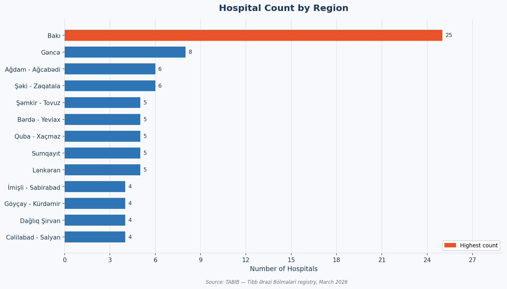
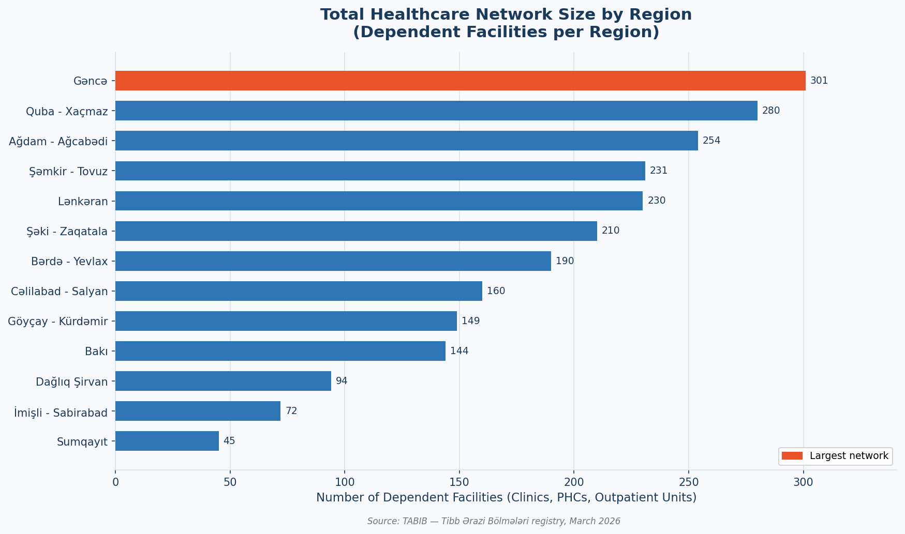
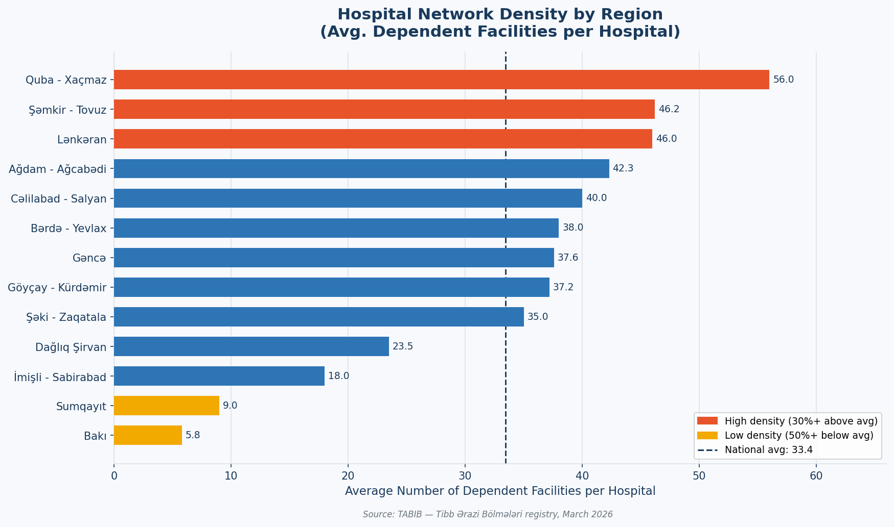
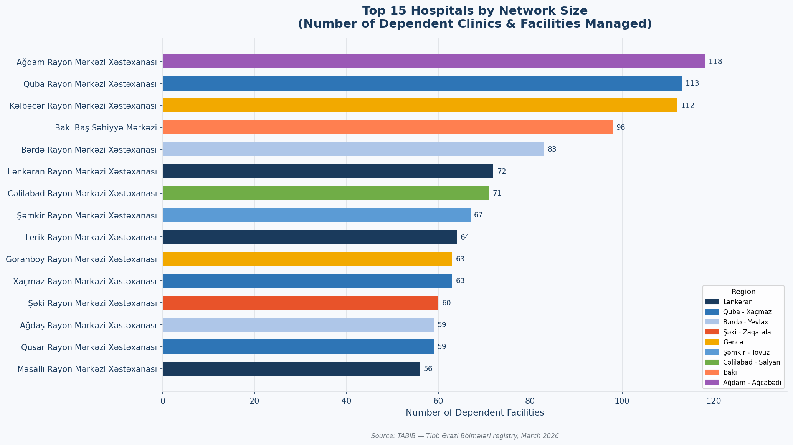
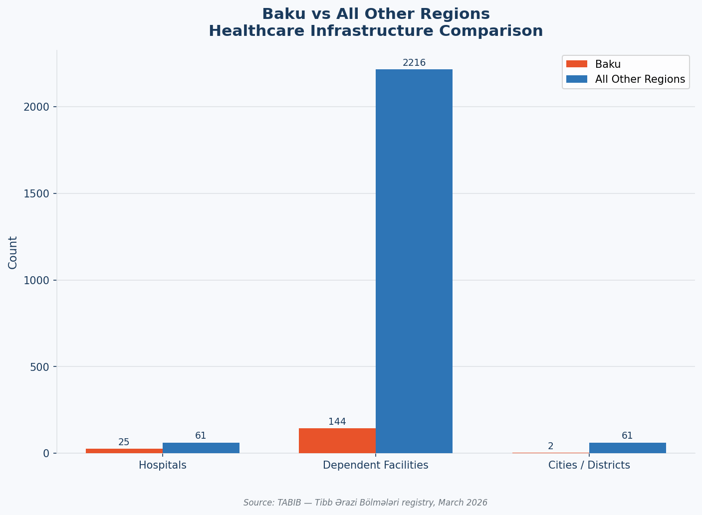
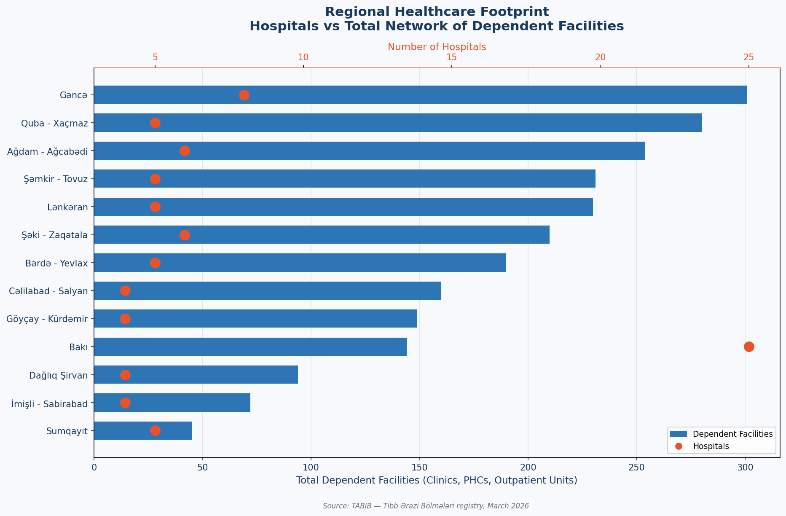

# Azerbaijan Healthcare Infrastructure — Business Insight Report

- **Data Source:** TABIB (Tibbi Ərazi Bölmələri Registry)
- **Coverage:** All 13 Medical Territorial Divisions across Azerbaijan
- **Report Date:** March 2026

---

## Executive Summary

Azerbaijan's public healthcare system is built around **86 hospitals** managing a network of **2,360 dependent facilities** — clinics, outpatient units, primary health centres, and specialist units — spread across **13 regional divisions** and **63 cities and districts**.

This report presents six key findings that reveal where healthcare capacity is concentrated, where structural imbalances exist, and what actions regional health authorities and policy makers should prioritise.

---

## Finding 1 — Baku Holds 29% of All Hospitals but Serves Only 2 Administrative Areas

**What the chart shows:**
Baku's medical territorial division contains **25 hospitals** — more than three times the size of the next largest region (Gəncə, with 8). Every other region operates between 4 and 6 hospitals. Thirteen regions divide the country's healthcare supply very unequally.

**Why it matters:**
Nearly one in three hospitals in the entire country is located in a single city. This reflects decades of capital-centric investment. For the majority of the population living outside Baku, access to specialist care requires significant travel — or simply goes unmet. Any national strategy for equitable healthcare delivery must confront this concentration directly.

**Decision points:**
- Which regions are underserved relative to their population size?
- Is Baku's hospital count still growing, or has growth shifted to the regions?
- What is the referral burden that flows from regional hospitals into Baku?

---

## Finding 2 — Gəncə Runs the Largest Regional Network Despite Having Only 8 Hospitals

**What the chart shows:**
When measured by **total dependent facilities** — the clinics, health posts, and outpatient units that each hospital manages — Gəncə leads all regions with **301 facilities**, followed closely by Quba–Xaçmaz (280) and Ağdam–Ağcabədi (254). Baku, despite its 25 hospitals, manages only **144 dependent facilities** — the second lowest in the country.

**Why it matters:**
This inverts the conventional view that Baku dominates everything. In terms of the actual **service delivery network** — the facilities where most citizens interact with the healthcare system daily — rural and semi-urban regions carry far more weight. Gəncə alone manages twice as many dependent facilities as Baku.

**Decision points:**
- Are Gəncə's 301 facilities adequately staffed and supplied?
- Should management and funding models differ between Baku (hospital-heavy) and regions (network-heavy)?
- What is the performance gap between a large urban hospital and a rural dependent clinic?

---

## Finding 3 — Rural Hospitals Carry Dramatically Larger Administrative Burdens

**What the chart shows:**
The national average is **27.4 dependent facilities per hospital**. Quba–Xaçmaz hospitals average **56 dependent facilities each** — more than twice the national average. Gəncə and Ağdam–Ağcabədi hospitals average **37–42**. At the other extreme, Baku hospitals average just **5.8 dependent facilities** each, and Sumqayıt averages **9** — both well below the national norm.

**Why it matters:**
A hospital managing 56 subordinate facilities faces a fundamentally different operational challenge than one managing 6. Rural hospital directors are effectively running **mini health systems** — coordinating staffing, supply chains, and patient flows across dozens of sites. These institutions need correspondingly stronger management infrastructure, logistics support, and digital systems — yet they typically receive less administrative resource than urban counterparts.

**Decision points:**
- Are high-density hospitals (Quba–Xaçmaz, Gəncə) properly resourced to manage their networks?
- Should per-hospital funding formulas account for dependent facility count?
- What is the maximum sustainable network a single hospital can manage effectively?

---

## Finding 4 — Five Hospitals Each Manage Over 100 Dependent Facilities

**What the chart shows:**
Three hospitals — **Ağdam Rayon (118), Quba Rayon (113), and Kəlbəcər Rayon (112)** — each manage more than 100 subordinate facilities. Baku Baş Səhiyyə Mərkəzi (98) and Bərdə Rayon (83) follow closely. These five institutions collectively govern nearly **524 facilities**, representing **22% of the entire national network**, all managed by just 5 hospital leadership teams.

**Why it matters:**
Kəlbəcər is notable: it manages 112 facilities in a post-conflict reconstruction zone where infrastructure was largely rebuilt from 2020 onwards. This scale of operations in a rebuilding region is both an achievement and a risk — any leadership instability, supply disruption, or staffing crisis at a single hospital affects over 100 facilities and thousands of patients simultaneously.

**Decision points:**
- Do the top-5 hospitals have dedicated operational management teams, or are they led by clinical directors managing both patient care and network administration?
- What contingency plans exist if a high-network hospital faces a crisis?
- Kəlbəcər's size is a reconstruction priority — is it receiving reconstruction-tier funding?

---

## Finding 5 — Baku Concentrates Hospitals; Regions Carry the Patient-Facing Network

**What the chart shows:**
Baku has **25 hospitals** vs 61 for all other regions combined. But when comparing dependent facilities, Baku has **144** vs **2,216** for the rest of the country — a **15-to-1** ratio. Baku covers 2 administrative areas; all other regions collectively cover 61.

**Why it matters:**
The healthcare system has two distinct operating models running in parallel:
- **Baku:** Hospital-centric, specialist-heavy, concentrated in a small geography
- **Regions:** Network-centric, primary-care-heavy, spread across 61 districts

These are not variations of the same system — they are structurally different systems requiring different governance, different resourcing formulas, and different performance metrics. Treating them identically in national policy leads to persistent misallocation.

**Decision points:**
- Should regional and Baku divisions have separate performance frameworks?
- Is primary care capacity in the regions sufficient given the number of facilities they manage?
- What volume of patients travel from regions to Baku annually, and could regional investment reduce that flow?

---

## Finding 6 — Every City Outside Baku Has Exactly One Hospital

**What the chart shows:**
The footprint chart reveals that **62 of the 63 cities** in the national registry have a single hospital as their anchor institution. Only Baku has multiple hospitals. Each regional hospital is simultaneously the **primary, secondary, and referral provider** for its entire district — while also managing dozens of subordinate clinics.

**Why it matters:**
Single-hospital districts have zero redundancy. If that hospital faces a capacity crisis — an epidemic surge, a staffing shortage, equipment failure — there is no alternative facility in the same city to absorb patients. This is a systemic resilience risk that affects the majority of Azerbaijan's population. The national system is one crisis per district away from a local healthcare collapse in 62 cities.

**Decision points:**
- What is the minimum safe bed capacity and specialty coverage for a single-hospital city?
- Are resilience and surge capacity standards defined and monitored for single-hospital districts?
- Which districts have the highest population-to-hospital ratios and are therefore highest risk?

---

## Summary: Four Decisions This Report Should Inform

| Priority | Finding | Recommended Direction |
|---|---|---|
| **1. Network equity** | Rural hospitals manage 10x more facilities than urban ones | Reweight operational funding by dependent facility count, not hospital count |
| **2. Resilience** | 62 cities have zero hospital redundancy | Define surge capacity and backup protocols for all single-hospital districts |
| **3. High-risk institutions** | 5 hospitals govern 22% of the national network | Assign dedicated operational managers and conduct annual network audits |
| **4. System model gap** | Baku and regions are structurally different systems | Create distinct governance and performance frameworks for urban vs regional divisions |

---

## Data Coverage Notes

| Metric | Value |
|---|---|
| Regions analysed | 13 of 13 (100%) |
| Hospitals with contact data | 86 of 86 (100%) |
| Hospitals with address data | 86 of 86 (100%) |
| Hospitals with descriptions | 86 of 86 (100%) |
| Dependent facilities mapped | 2,360 |

All 86 hospitals in the TABIB registry have complete contact and address information, confirming the dataset is suitable for operational use, mapping, and patient-facing communication.

---

*Report generated from TABIB public registry data — tabib.gov.az — March 2026.*
*Charts: `charts/` | Raw data: `data/data.xlsx` | Script: `scripts/generate_charts.py`*
